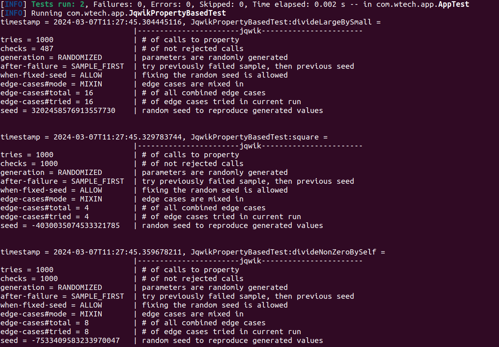

<p>
    
  
</p>

Property based testing in java with jqwik
=============
[](https://openjdk.org/projects/jdk/21/)
[](https://maven.apache.org/)
[](https://junit.org/junit5/)
[](https://assertj.github.io/doc/)
[](https://maven.apache.org/)

## Introduction

This project is dedicated to testing and validating various scenarios using property based testing in Java. It
showcases different algorithms and their usage, providing a practical insight into property based testing with jqwik.

## Property-based testing (PBT)

Property-based testing (PBT) is a testing technique where you define the general properties your code should satisfy and
then run tests against a wide range of inputs to ensure the properties hold. In Java, jqwik is a popular library for
PBT. Below are varied code examples demonstrating the use of jqwik for property-based testing in Java, ranging from
basic to advanced scenarios.

## Examples

* [NormalValuesTest.java](src%2Ftest%2Fjava%2Fcom%2Fwtech%2Fapp%2FNormalValuesTest.java): A basic standard unit test.
* [ParameterizedValuesTest.java](src%2Ftest%2Fjava%2Fcom%2Fwtech%2Fapp%2FParameterizedValuesTest.java): A parametrized
  unit test. That means we use more data, in order to try to cover more scenarios in the tests.
* [JqwikPropertyBasedTest.java](src%2Ftest%2Fjava%2Fcom%2Fwtech%2Fapp%2FJqwikPropertyBasedTest.java): Property based
  tests using jqwik for implementation. In those tests you will be able to see many examples to test a wide range of
  data.

## Prerequisites

* Java Development Kit (JDK) - Version 21 or higher.
* Maven - For managing dependencies and running the project.
* An IDE like IntelliJ IDEA, Eclipse, or VSCode for editing and running the Java
  files.
* Or simply run it in command line.

## How to run

1. Clone and go to the repository:

```bash
git clone git@github.com:wallaceespindola/java-property-based-testing-jqwik.git

cd java-property-based-testing-jqwik
```

2. Build the project with Maven:

```bash
mvn clean install
```

3. Running the main class to check that everything is OK:

```bash
java -jar ./target/java-property-based-testing-jqwik.jar 
```

4. Running the main examples:

```bash
mvn test
```

5. This project is using Java 21, if you want to run it with a previous version, modify the pom.xml and compile to your
   preferred version:

```bash
<maven.compiler.source>21</maven.compiler.source>
<maven.compiler.target>21</maven.compiler.target>
```

6. You can also run the unit tests for each algorithm on your IDE at the path 'src/test/java'.

## Execution example



## Hypothesis shrinking brief explanation

> Hypothesis shrinking is a process that occurs after a test failure is detected. When jqwik finds an example that
causes your test to fail, it doesn't stop there. Instead, it tries to simplify or "shrink" the example to the smallest
or simplest form that still causes the test to fail. This feature is incredibly useful because it often uncovers the
minimal scenario that triggers the bug, making it easier to understand and fix.

## References

* An introduction to property based
  testing: https://medium.com/criteo-engineering/introduction-to-property-based-testing-f5236229d237
* Jqwik, PBT for Java: https://jqwik.net/docs/current/user-guide.html
* A PBT article focused on java: https://blog.johanneslink.net/2018/03/26/from-examples-to-properties/
* A PBT java tutorial: https://www.baeldung.com/java-jqwik-property-based-testing
* Property testing definition: https://en.wikipedia.org/wiki/Property_testing
* Kotest, a test framework with PBT integrated: https://kotest.io/docs/proptest/property-based-testing.html
* What is PBT, another point of view: https://hypothesis.works/articles/what-is-property-based-testing/

## Author

* Wallace Espindola, Sr. Software Engineer & Architect / Java & Python Dev
* E-mail: wallace.espindola@gmail.com
* LinkedIn: https://www.linkedin.com/in/wallaceespindola/
* Website: https://wtechitsolutions.com/

## License

* This project is released under the Apache 2.0 License. For more details, see [LICENSE](LICENSE).
* Copyright © 2024 [Wallace Espindola](https://github.com/wallaceespindola/).
